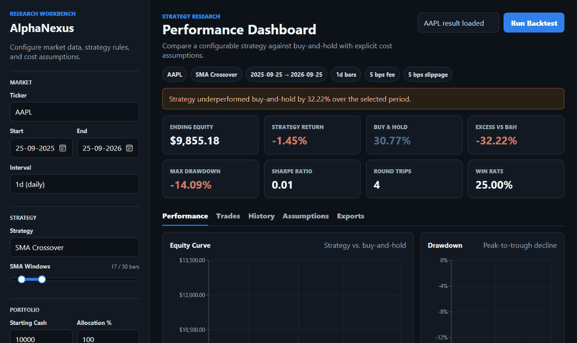
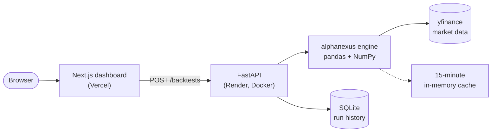
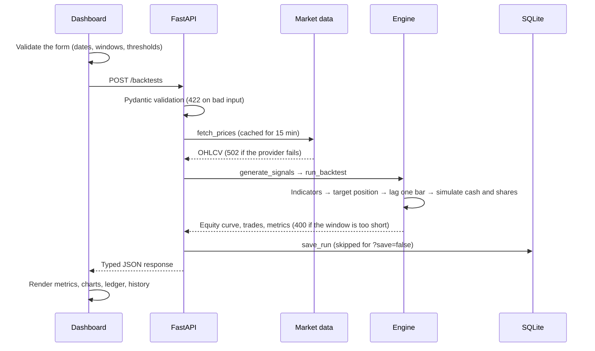
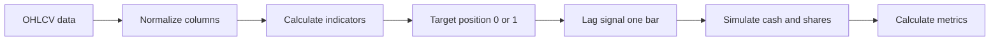
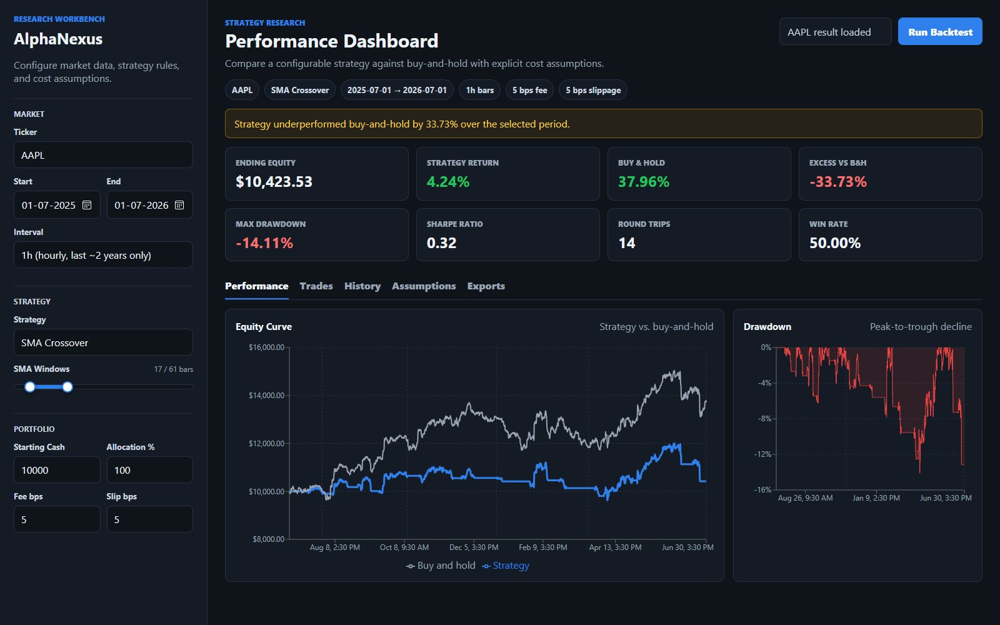

<div align="center">

# AlphaNexus

**A full-stack backtesting workbench that tests simple, explainable trading rules against buy-and-hold, and shows every assumption behind the result.**

[](https://github.com/TJA0308/AlphaNexus/actions/workflows/ci.yml)
[](#testing-and-ci)
[](LICENSE)


[](https://alpha-nexus-ashy.vercel.app/)
[](https://alphanexus-api.onrender.com/docs)



</div>

> [!NOTE]
> The dashboard runs an example AAPL backtest as soon as it opens. The API runs on Render's free tier, which sleeps when idle. If it has been asleep, the first request can take up to a minute to wake it, and the dashboard tells you while it waits.

**Contents:** [At a glance](#at-a-glance) · [Architecture](#architecture) · [Engineering decisions](#engineering-decisions) · [Strategies](#strategies) · [API](#api) · [Run it locally](#run-it-locally) · [Testing and CI](#testing-and-ci) · [Project structure](#project-structure) · [Limitations](#limitations-and-roadmap)

## At a glance

| | |
| --- | --- |
| **What it does** | Loads market data, runs one of three rule-based strategies, simulates a long-only portfolio with fees and slippage, and compares it with buy-and-hold |
| **Stack** | Python engine (pandas, NumPy) → FastAPI + SQLite → Next.js / TypeScript dashboard, deployed on Render and Vercel |
| **Correctness** | Signals trade one bar after they are observed (no look-ahead), and too-short windows are refused rather than reported as a 0% return |
| **Tests** | 98 Python tests at ~97% line coverage, 32 frontend tests, and a 72-scenario deterministic benchmark, all run in CI |
| **Performance** | Execution loop over NumPy arrays: 50,000 bars in ~0.17 s, down from ~8.8 s with `iterrows()` |
| **Ops** | Docker image checked in CI, typed OpenAPI contract, Dependabot updates, one-command `make check` |

## Why I built it

A notebook can compute a backtest return in a few lines, and it can hide exactly the details that decide whether the number means anything: when a signal becomes tradable, how costs are charged, what happens to cash and shares, and whether the comparison with buy-and-hold is fair.

AlphaNexus makes that pipeline inspectable. Data loading, indicators, signals, portfolio simulation, metrics, the API, and the dashboard live in separate layers that are small enough to explain and test one at a time. It is a research and education tool, not a trading system, and it makes no claim that these strategies beat the market. With the default settings, the example on the dashboard shows a strategy losing to buy-and-hold, and the page says so.

## Architecture



<details>
<summary><b>What happens inside one backtest request</b></summary>

<br>



</details>

<details>
<summary><b>The engine pipeline, step by step</b></summary>

<br>



The engine is a plain Python package with no dependency on the web layer, so the tests and the benchmark call it directly without starting a server or a browser. More detail is in [docs/architecture.md](docs/architecture.md).

</details>

## Engineering decisions

Click a decision to see the reasoning.

<details>
<summary><b>Signals execute one bar after they are observed</b>: no look-ahead bias</summary>

<br>

An indicator computed from bar `t`'s close cannot also trade at that same close, because you only know the close once the bar is over. Target positions are shifted one bar before trades are generated, so information seen at `t` is acted on at `t+1`. An earlier version got this wrong; fixing it changed the results, and a regression test now holds the behavior in place.

</details>

<details>
<summary><b>Too-short windows are refused, not reported as 0%</b></summary>

<br>

If the date range is shorter than a strategy's warm-up (for example, 50 bars for a 50-bar SMA, plus one for the lag), the indicators never produce a value and the strategy can never trade. The API used to return a confident 0.00% return for that. It now returns a 400 that states how many bars were available and how many are needed. This has to be decided from the window length: an all-zero signal is also exactly what a flat market produces, so the output alone can't tell "no data" from "no trades".

</details>

<details>
<summary><b>The execution loop is sequential, but array-based</b>: ~50× faster at 50k bars</summary>

<br>

Each entry is sized from the cash the previous exit left, so bar `t` depends on every trade before it, and the simulation can't be a single vectorized expression. The cost was never the loop itself; it was `DataFrame.iterrows()`, which builds a pandas Series for every bar. Looping over NumPy arrays produces identical output (checked frame-for-frame against the old engine) and takes 50,000 hourly bars from ~8.8 s to ~0.17 s.

</details>

<details>
<summary><b>Sharpe is annualized by the bars the provider actually returns</b></summary>

<br>

yfinance returns seven hourly bars per US trading session. The last one covers only half an hour, but it is still a bar. So the hourly annualization factor is `252 × 7`, not the `252 × 6.5` that the session length suggests. I checked the bar count against a month of AAPL and MSFT data; the old factor understated hourly Sharpe by about 3.6%.

</details>

<details>
<summary><b>Errors are classified by whose fault they are</b>: 400 / 422 / 502</summary>

<br>

A malformed request is a 422 (schema) or a 400 (engine rule, such as the fast SMA not being shorter than the slow one). An unknown ticker is a 400 whose message says what to change. A market-data provider outage or rate limit is a 502, because nothing the caller sent was wrong. The dashboard turns FastAPI's two error shapes (a string or a list of field errors) into one readable message.

</details>

<details>
<summary><b>Every endpoint has a typed response model</b></summary>

<br>

Pydantic models describe every response, so the [OpenAPI page](https://alphanexus-api.onrender.com/docs) documents the full contract, and `frontend/lib/types.ts` mirrors it. A test fails if an endpoint is added without a response model.

</details>

<details>
<summary><b>The benchmark uses fixed synthetic data, not live downloads</b></summary>

<br>

Network timing and upstream data revisions make live downloads useless for regression timing. The benchmark runs 8 synthetic OHLCV fixtures (trending, mean-reverting, volatile, shock-and-recovery, and so on) × 3 date windows × 3 strategies = 72 scenarios, and CI fails if the p95 engine time goes over 100 ms. See [benchmarks/README.md](benchmarks/README.md).

</details>

<details>
<summary><b>The engine is long-only by design</b></summary>

<br>

The portfolio holds cash or one long position, so position state, fees, realized PnL, and every trade record can be checked by hand. Short selling or leverage would need margin, borrow costs, and liquidation rules, which makes it a different engine rather than another dropdown option.

</details>

## Strategies

| Strategy | Enter long when | Exit to cash when |
| --- | --- | --- |
| **SMA crossover** | The fast SMA rises above the slow SMA | The fast SMA falls below the slow SMA |
| **RSI mean reversion** | RSI falls below the oversold threshold | RSI rises above the overbought threshold |
| **Bollinger breakout** | The close rises above the upper band | The close falls below the center line |

Every strategy outputs a target position of `1` (long) or `0` (cash); the engine turns changes in that target into trades. Metrics reported: total return, buy-and-hold return, **excess return** (deliberately not called alpha, since there is no beta or risk adjustment), max drawdown, Sharpe ratio, round trips, win rate, and ending equity.

## API

Interactive docs: **[alphanexus-api.onrender.com/docs](https://alphanexus-api.onrender.com/docs)**. You can send real requests from that page.

| Method | Path | Description |
| --- | --- | --- |
| `GET` | `/health` | Service health |
| `GET` | `/strategies` | Supported strategies |
| `GET` | `/backtests?limit=20` | Recent saved runs, newest first (limit 1–100) |
| `POST` | `/backtests` | Run a backtest and save its summary; `?save=false` skips saving |

<details>
<summary><b>Example request</b> (copy and paste)</summary>

<br>

```bash
curl -X POST "https://alphanexus-api.onrender.com/backtests?save=false" \
  -H "Content-Type: application/json" \
  -d '{
    "ticker": "AAPL",
    "start": "2024-01-01",
    "end": "2024-12-31",
    "interval": "1d",
    "strategy": "sma_crossover",
    "starting_cash": 10000,
    "fee_bps": 5,
    "slippage_bps": 5,
    "fast_window": 17,
    "slow_window": 50
  }'
```

</details>

<details>
<summary><b>Example response</b> (trimmed: the real one has 251 equity points)</summary>

<br>

```json
{
  "ticker": "AAPL",
  "strategy": "sma_crossover",
  "metrics": {
    "total_return": 0.2884,
    "benchmark_return": 0.3585,
    "excess_return_vs_benchmark": -0.0702,
    "max_drawdown": -0.1175,
    "sharpe_ratio": 1.5399,
    "trade_count": 2,
    "win_rate": 1.0,
    "ending_equity": 12883.53
  },
  "equity_curve": [
    { "date": "2024-01-02T00:00:00", "close": 185.64, "portfolio_value": 10000.0,
      "benchmark_value": 10000.0, "drawdown": 0.0, "signal": 0, "trade_signal": 0 }
  ],
  "trades": [
    { "date": "2024-05-10T00:00:00", "close": 183.05, "trade_signal": 1, "shares": 54.5753,
      "cash": 0.0, "portfolio_value": 9990.01, "realized_pnl": 0.0 }
  ]
}
```

</details>

## Run it locally

Requires Python 3.11+ and Node.js 22.

<details open>
<summary><b>macOS / Linux</b></summary>

<br>

```bash
python -m venv .venv && source .venv/bin/activate
make install        # Python dev requirements + frontend packages
make dev-api        # API on http://127.0.0.1:8000
```

In a second terminal:

```bash
echo "NEXT_PUBLIC_API_BASE_URL=http://127.0.0.1:8000" > frontend/.env.local
make dev-web        # dashboard on http://127.0.0.1:3000
```

</details>

<details>
<summary><b>Windows (PowerShell)</b></summary>

<br>

```powershell
python -m venv .venv; .venv\Scripts\Activate.ps1
pip install -r requirements-dev.txt
uvicorn api.main:app --reload
```

In a second terminal:

```powershell
cd frontend
Set-Content .env.local "NEXT_PUBLIC_API_BASE_URL=http://127.0.0.1:8000"
npm install
npm run dev
```

</details>

<details>
<summary><b>Docker (API only)</b></summary>

<br>

```bash
docker build -t alphanexus-api .
docker run -p 8000:8000 alphanexus-api
```

</details>

> [!TIP]
> Without `.env.local`, the local dashboard talks to the deployed API. That's handy for UI work, but your local backend changes won't show up.

## Testing and CI

| Check | Command | What it covers |
| --- | --- | --- |
| Lint (Python) | `make lint` | ruff: pyflakes, pycodestyle, import order, bugbear, pyupgrade |
| Tests + coverage | `make coverage` | 98 tests at ~97% line coverage; fails below 90% |
| Benchmark | `make benchmark` | 72 deterministic scenarios; fails if p95 > 100 ms |
| Frontend | `make frontend-check` | ESLint, `tsc`, 32 Vitest tests, production build |
| **Everything** | `make check` | All of the above, the same as CI minus the container check |

<details>
<summary><b>What the tests cover</b></summary>

<br>

- **Engine:** signal lag, warm-up refusal, fees and slippage direction, allocation, exactly-zero cash after a full entry, open positions at the end, trade-ledger accuracy
- **Metrics:** drawdown, Sharpe (including annualization and the undefined first return), win rate counted on exits
- **Data:** column normalization, caching and cache expiry, a provider outage (502) versus a bad ticker (400)
- **Storage:** round trip, ordering, limit clamping, and that every SQLite connection is actually closed
- **API:** status codes, the response schema of every endpoint, persistence and `save=false`
- **Frontend:** the API client (both FastAPI error shapes, timeouts), CSV escaping (RFC 4180), form validation, loading messages

Market data is stubbed in every test, so the suite never touches the network.

</details>

CI runs on every pull request: Python lint, tests with coverage (the per-file table appears on the run's summary page), the benchmark gate, the frontend checks, and a Docker build that must pass a `/health` check. Dependabot opens grouped weekly dependency updates, and each one runs through the same CI before it is merged.

## Project structure

<details>
<summary><b>Show the tree</b></summary>

<br>

```text
alphanexus/             Python engine (no web dependencies)
  data.py                 yfinance loading, normalization, 15-minute cache
  indicators.py           SMA, RSI (Wilder), Bollinger Bands
  strategies.py           Indicator → target position, one-bar lag, warm-up rules
  backtest.py             Cash, shares, fees, slippage, realized PnL
  metrics.py              Return, drawdown, Sharpe, win rate
  storage.py              SQLite run history
api/main.py             FastAPI routes, request and response models
frontend/
  app/                    Next.js page, styles, icon
  components/             Controls, metric cards, charts, tables, run history
  lib/                    API client, types, formatting, validation, status (+ Vitest)
benchmarks/             Synthetic fixtures, scenario matrix, timing runner
tests/                  pytest suite
docs/                   Architecture, deployment, demo media
Makefile                One-command dev, test, and CI checks
Dockerfile              API image (checked in CI)
```

</details>

<details>
<summary><b>Reproduce the screenshot below</b></summary>

<br>



On the [live dashboard](https://alpha-nexus-ashy.vercel.app/), set **AAPL**, **SMA Crossover**, interval **1h**, **2025-07-01 → 2026-07-01**, SMA windows **17 / 61**, **$10,000** cash, **5 bps** fee, and **5 bps** slippage. Values can shift slightly if the data provider revises its history.

</details>

## Limitations and roadmap

<details>
<summary><b>Known limitations</b> (read before trusting any number)</summary>

<br>

- Long-only, single asset; no leverage, shorting, or options
- Signals fill at the next bar's **close**; no next-open execution or order-book model beyond flat slippage
- Open positions are valued at the final close rather than force-sold
- Prices are split-adjusted but **not dividend-adjusted**, so neither side earns dividends
- Buy-and-hold is shown **without** costs, which makes it a slightly harder benchmark to beat
- No walk-forward or out-of-sample parameter selection yet
- yfinance hourly data only reaches back about two years
- SQLite history resets when Render redeploys (no persistent disk on the free tier)

</details>

**Next up:** walk-forward evaluation and parameter-sensitivity analysis, dividend-adjusted prices, next-open execution, multi-asset portfolios, and an external benchmark symbol.

## License

[MIT](LICENSE) © Tejasv Agarwal

> [!WARNING]
> For research and education only. This is not financial advice and does not predict future returns.
